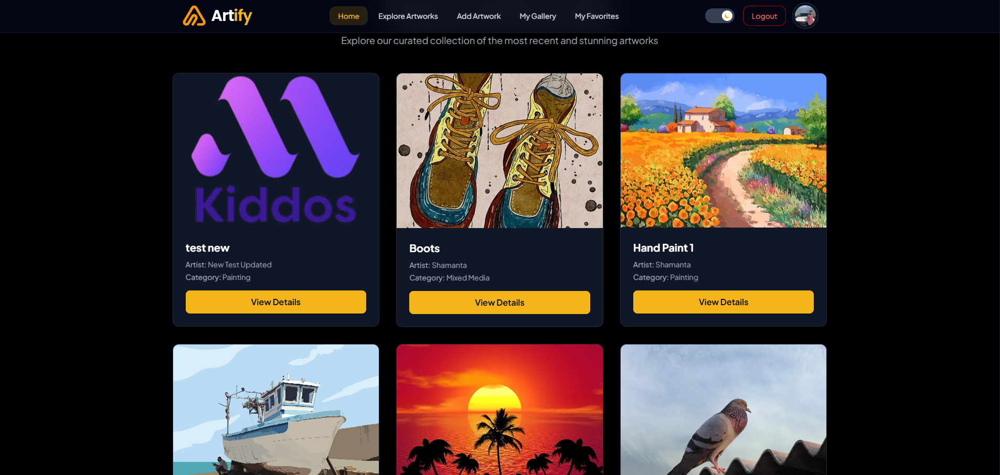

# ARTIFY

Artify is a curated digital art marketplace that spotlights emerging creators, celebrates diverse art styles, and makes discovering inspiring pieces effortless.

- **Live Site:** https://artify-sami.netlify.app/

## Highlights

- Dynamic hero and gallery experiences that showcase featured artists and collections in real time
- Personalized artist gallery with storytelling, social proof, and portfolio highlights
- Interactive filtering and search tools to explore art by theme, medium, or popularity
- Responsive layouts and smooth animations that feel at home on any device
- Seamless onboarding and Firebase-authenticated flows that keep collectors engaged

## Tech & Packages

- React 19 with Vite for a modern, fast development experience
- React Router v7 for client-side routing
- Tailwind CSS 4 and DaisyUI components for styling and design consistency
- Axios for REST API integration with the Artify backend
- Firebase for authentication and backend services
- React Awesome Reveal, React Hot Toast, React Simple Typewriter, and React Image Gallery for user experience enhancements

## Getting Started

1. Install dependencies: `npm install`
2. Run the development server: `npm run dev`
3. Build for production: `npm run build`
